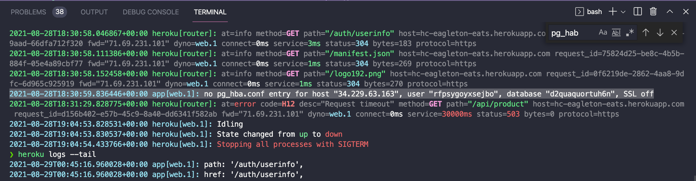

# [Eagleton Eats](https://hc-eagleton-eats.herokuapp.com) 🍴 🍲 🍗 🍑


[eagleton-eats](https://hc-eagleton-eats.herokuapp.com)

**Eagleton restaurant - From farm to table to healthy dinner meals best in town!** 🍴 🍲

[Live website](https://eat-at-home-server.herokuapp.com/)

## Project Mission

Eagleton Eats is an app for users who want a good home cooking meal without any hassle of cooking. If you are ready for tasty and healthy meal promptly then you've come to right place! Eagleton Eats is sustainable. We source all our produce from local farmers within 30 miles from our town. We care deeply about carbon footprints and committed to give back to local community.

## 🛠️ Technologies Used

- CSS
- React.js
- Javascript
- Node.js
- Express.js
- Passport.js
- PostgreSQL
- PG Promise
- OAuth Authentication
- Heroku
- [Heroku Postgres](https://elements.heroku.com/addons/heroku-postgresql)
- Beekeeper
- AWS server
- Psql

## 🐼 🥷 Difficult parts we faced while building our app:

- After deployment: Heroku's aws database would not save items to Product table nor display already seeded the database.



- error message about SSL off

```
no pg_hba.conf entry for host "34.229.63.163", user "rfpsygoyxsejbo", database "d2quaquortuh6n", SSL off
```

- fix: how you can turn on SSL for your postgres connection.

https://stackoverflow.com/questions/60048669/heroku-postgres-psql-fatal-no-pg-hba-conf-entry-for-host

- for SSL
  https://devcenter.heroku.com/articles/heroku-postgresql#connecting-in-node-js

```js
// before fix
const pool = new Pool({
  user: process.env.DB_USER_NAME,
  password: process.env.DB_USER_PASSWORD,
  host: process.env.DB_HOST,
  port: process.env.DB_PORT,
  database: process.env.DB_NAME,
});

// after fix
const pool = new Pool({
  user: process.env.DB_USER_NAME,
  password: process.env.DB_USER_PASSWORD,
  host: process.env.DB_HOST,
  port: process.env.DB_PORT,
  database: process.env.DB_NAME,
  ssl: {
    rejectUnauthorized: false, // <===== add this line to turn off SSL OFF
  },
});
```

## ⚙ How to run locally

### 1. Clone this repository

- Under the [Github rep](https://github.com/heggy231/eagleton-eats) name, click on the code button and copy the clone URL for this [repo](https://github.com/heggy231/eagleton-eats).
- Open your terminal and type `git clone https://github.com/heggy231/eagleton-eats.git`.

### 2. Open the folder

- After cloning the [github rep](https://github.com/heggy231/eagleton-eats), use your favorite code editor to open the folder. We recommend [Visual Studio Code](https://code.visualstudio.com/).

### 3. Install the required software

You will need to install [PostgreSQL](https://www.postgresql.org/download/) and [Node.js](https://nodejs.org/en/) to run the back-end and check eagleton database.

### 4. Install the dependencies and `.env` file

- Run `npm install` or `yarn install` in your terminal from the `root` and `react-ui` folder

- Create `.env` file in the `root` folder and add the following lines:

```
PORT=8080
FACEBOOK_CALLBACK_URL=http://localhost:8080/auth/facebook/callback
GITHUB_CLIENT_ID=<YOUR ID GOES HERE>
GITHUB_CLIENT_SECRET=<YOUR CLIENT SECRET GOES HERE>
GITHUB_CALLBACK_URL=http://localhost:8080/auth/github/callback

FRONTEND_URL=http://localhost:3000
```

When running the app locally:
Please make sure your `db.js` logically does this. The value should be assigned already in your `.env` file.

```js
// connect db Eagleton using pg lib
const Pool = require("pg").Pool; // from pg Promise lib instantiate pool db

const pool = new Pool({
  user: "",
  password: "",
  host: "localhost",
  port: 5432,
  database: "eagleton",
});

// export db connection to the rest of the app
module.exports = pool;
```

### 5. Execute the application

- Start your Postgres database. Create database and table in `psql` command line or BeeKeeper.

```psql
CREATE DATABASE eagleton;

CREATE TABLE product(
  product_id SERIAL PRIMARY KEY,
  name VARCHAR(255)
);
```

- Run `npm start` or `yarn start` in your terminal from the `root` and `react-ui` folder.

- Comment out ssl object "SSL connection rejectAuthorized: false" in `db.js`. Unless you do this, you will one, see this server error message: `The server does not support SSL connections` and two, can't retrieve your data from database nor post new data on Product page. Once you are done running it locally, please turn SSL back on for your postgres connection.

```js
// inside `db.js`
// This is an example on how to `TURN OFF SSL` in order to run eagleton database locally
const Pool = require("pg").Pool;

const pool = new Pool({
  user: process.env.DB_USER_NAME,
  password: process.env.DB_USER_PASSWORD,
  host: process.env.DB_HOST,
  port: process.env.DB_PORT,
  database: process.env.DB_NAME,
  // ssl: {
  //   rejectUnauthorized: false,
  // },
});

// export db connection to the rest of the app
module.exports = pool;
```

- Please remember turn on SSL for your postgres connection once you are done running it locally so that remote users can connect to your database. You can do this by commenting in `ssl` object in `db.js`. You can read more about [SSL here.](https://stackoverflow.com/questions/54302088/how-to-fix-error-the-server-does-not-support-ssl-connections-when-trying-to-a)

### 6. Open in your browser

- The application will be available at http://localhost:3000.
  <br>

<h3>🥗🍗🥂🎂 Congrats!</h3>
You have successfully built your own Eagleton Eats app locally.
`✧*｡٩(ˊᗜˋ*)و✧*｡`
