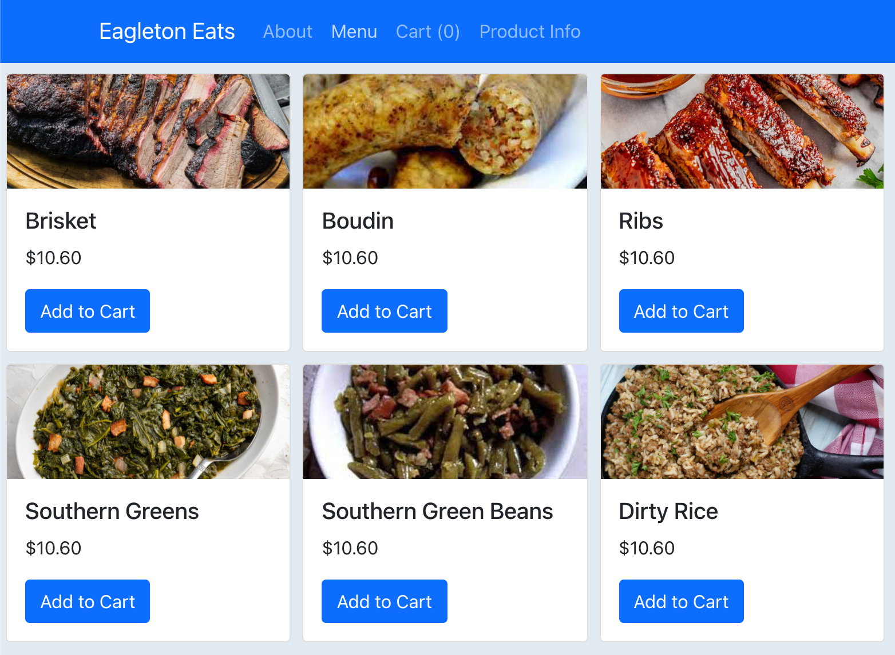

# [Eagleton Eats](https://hc-eagleton-eats.herokuapp.com) 🍴 🍲 🍗 🍑



[eagleton-eats](https://hc-eagleton-eats.herokuapp.com)

**Eagleton restaurant - From farm to table to healthy dinner meals best in town!** 🍴 🍲

[Live website](https://eat-at-home-server.herokuapp.com/)

## Project Mission

Eagleton Eats is an app for users who want a good home cooking meal without any hassle of cooking. If you are ready for tasty and healthy meal promptly then you've come to right place! Eagleton Eats care for sustainable food and source it from local farmers. We care deeply about carbon footprint and committed to give back to local community.

## 🛠️ Technologies Used

- CSS
- React.js
- Javascript
- Node.js
- Express.js
- Passport.js
- PostgreSQL
- Sequelize
- OAuth Authentication
- Heroku

## ⚙ How to run

### 1. Clone this repository

- Under the repository name, click on the code button and copy the clone URL for this repository.
- Open your terminal and type `git clone https://github.com/heggy231/eagleton-eats.git`.

### 2. Open the folder

- After cloning the repository, use your favorite code editor to open the folder. We recommend [Visual Studio Code](https://code.visualstudio.com/).

### 3. Install the required software

You will need to install [PostgreSQL](https://www.postgresql.org/download/) and [Node.js](https://nodejs.org/en/) to run the back-end piece.

### 4. Install the dependencies and `.env` file

- Run `npm install` or `yarn install` in your terminal from the `root` and `react-ui` folder

- Create `.env` file in the `root` folder and add the following lines:

```
PORT=8080
FACEBOOK_CALLBACK_URL=http://localhost:8080/auth/facebook/callback
GITHUB_CLIENT_ID=<YOUR ID GOES HERE>
GITHUB_CLIENT_SECRET=<YOUR CLIENT SECRET GOES HERE>
GITHUB_CALLBACK_URL=http://localhost:8080/auth/github/callback

FRONTEND_URL=http://localhost:3000
```

### 5. Execute the application

- Start your database in postgres and create tables in `psql` command line.

```psql
CREATE DATABASE eagleton;

CREATE TABLE product(
  product_id SERIAL PRIMARY KEY,
  name VARCHAR(255)
);
```

- Run `npm start` or `yarn start` in your terminal from the `root` and `react-ui` folder.

### 6. Open in your browser

- The application will be available at http://localhost:3000.
  <br>

<h3>Congrats!</h3>
You have successfully built your own eagleton eats app.
`✧*｡٩(ˊᗜˋ*)و✧*｡`
