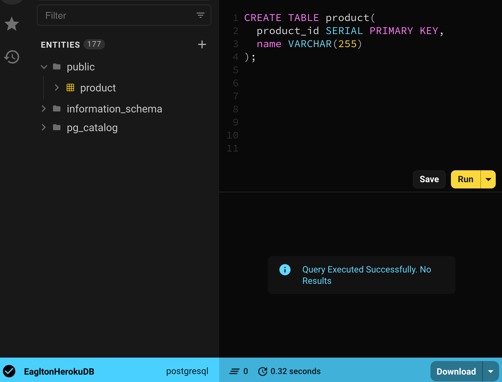

# repo [https://github.com/heggy231/eagleton-eats]

# How to run

## Heroku deployment leftover todo:

- create table in my beekeeper (connect to heroku postGres db)

- error
  https://stackoverflow.com/questions/26482777/create-database-cannot-run-inside-a-transaction-block

trying to create a db and table in heroku Postgres db

- error message: CREATE DATABASE cannot run inside a transaction block

- resolution: Heroku already created db so all I have to do is create table.

```sql

CREATE TABLE product(
  product_id SERIAL PRIMARY KEY,
  name VARCHAR(255)
);

```

do this in beekeeper => you should see
Query Executed success!



## dotenv

- Please create .env file
  // inside .env

```
PORT=8080

FACEBOOK_CALLBACK_URL=http://localhost:8080/auth/facebook/callback
GITHUB_CLIENT_ID=
GITHUB_CLIENT_SECRET=
GITHUB_CALLBACK_URL=http://localhost:8080/auth/github/callback

FRONTEND_URL=http://localhost:3000

DB_USER_NAME=""
DB_USER_PASSWORD=""
DB_HOST=localhost
DB_PORT=5432
DB_NAME=eagleton
```

## connecting to db

- https://devcenter.heroku.com/articles/heroku-postgresql#connecting-in-node-js

### code to keep

```js

      <Route exact path="/product" render={() => <InputProduct />} />


      <GuardedRoute exact path="/protected" component={Protected} auth={isAuthenticated} />
```

- database: https://blog.logrocket.com/getting-started-with-postgres-in-your-react-app/

- original repo (https://github.com/JKhariD/eagleton-eats)

- [Live Demo](https://hc-eagleton-eats.herokuapp.com/)
- create build for heroku
  first check how it looks locally when creat buind

1. cd to root dir
2. npm run build
   // this runs the script: "build": "cd react-ui/ && npm install && npm run build"
   then heroku runs the same

- [Heroku activity monitor for our app](https://dashboard.heroku.com/apps/hc-eagleton-eats/activity)

## how to make it single col in sm screen

- make the grid sm={7} if you have 2 col grid (7 is little over half of 12 which is the num of columns in total col in a page)

rename burger => favicon.ico

- for license.md use `mit github license`

- https://react-bootstrap.github.io/layout/grid/

- at the top level : express server
  to check things are all good:
  http://localhost:8080/heartbeat

- having two servers to connect using static files on root

## Heroku app deployment

- add build script for react which heroku knows to
  use this.

```json

  "scripts": {
    "build": "cd react-ui/ && npm install && npm run build",
    "test": "echo \"Error: no test specified\" && exit 1",
    "start": "node server.js",
    "dev": "nodemon server.js"
  },
  "cacheDirectories": [
    "node_modules",
    "react-ui/node_modules"
  ],

```

## communicate to backend

```js
// inside of InputProduct.jsx)
// step 1: package up the data I am sending
const body = { name };
// step 2: specify what method CREATE => POST, Update => PUT, Delete => DELETE
const response = await fetch("/api/product", {
  method: "POST",
  headers: { "Content-Type": "application/json" },
  body: JSON.stringify(body),
});

// inside of EditProduct.jsx)

// for deleting
// delete fetch request to backend
const deleteProd = await fetch(`/api/${id}`, {
  method: "DELETE",
});

// filter in ids that are not passed in id for page display only purpose
//  db has been updated but we don't want user to update the page to
//  see the page update with deleted dataset.
setProducts(products.filter((product) => product.product_id !== id));
```

## facebook passport

- how to create your own secret key, id

* https://developers.facebook.com/docs/facebook-login/web
* https://youtu.be/KlE9RAOl9KA

Valid OAuth Redirect URIs:
http://localhost:3000/auth/facebook/callback

# [eagleton-eats](https://hc-eagleton-eats.herokuapp.com)

## how do you run our app?

from root directory:

> npm run dev

```json

// query db, $1 is a place holder [name] this comes from the client side
// append RETURNING * command for update, delete, insert data into db
//   so that it returns back the data into my variable newProduct
const newProduct = await pool.query(
  "INSERT INTO product (name) VALUES($1) RETURNING *",
  [name]
);

// => result when posting new data since I want to return *
"rows": [
    {
        "product_id": 4,
        "name": "milk"
    }
],

// look of all data comes back
// to just see my new data newProduct.rows[0]
{
    "command": "INSERT",
    "rowCount": 1,
    "oid": 0,
    "rows": [
        {
            "product_id": 4,
            "name": "milk"
        }
    ],
    "fields": [
        {
            "name": "product_id",
            "tableID": 17488,
            "columnID": 1,
            "dataTypeID": 23,
            "dataTypeSize": 4,
            "dataTypeModifier": -1,
            "format": "text"
        },
```

- Inline style:
  use JS, name of attribute CamelCase
  Size in pixels - 40 = 40px inferred

```jsx
function About() {
  return (
    <h1
      style={{
        color: "violet",
        backgroundColor: "#fff",
        height: 40,
      }}
    >
      About
    </h1>
  );
}
```

- summary:
  class -> className
  for -> htmlFor
  camelCase css attributes

- named import

```js
import { render } from "react-dom";
```

// same as `const render = react-dom.render;` Creates a const called render that references react-dom's render function.

```js
import ReactDOM from "react-dom";
const render = ReactDOM.render;
```

- pathname

```js
// determine via url which component to render. window.location.pathname shows you which end point you are on http://localhost:3000/heggy => /heggy endpint
const route = window.location.pathname;
```

- routing using window.location.pathname

```js
import React from "react";
import AboutPage from "./AboutPage";
import HomePage from "./HomePage";

const App = () => {
  // determine via url which component to render. window.location.pathname shows you which end point you are on http://localhost:3000/heggy => /heggy endpint
  const route = window.location.pathname;
  if (route === "/about") return <AboutPage />;
  // if (route === "/") return <HomePage />;
  // otherwise, render the HomePage
  return <HomePage />;

  // return (
  //   <div>
  //     <HomePage />
  //     <AboutPage />
  //   </div>
  // );
};

export default App;
```

## cool script

```json
// run script parallel npm start dev:dev and npm start:api all happend at the same time
"start": "run-p start:dev start:api"
// this will star my app and mock api server where my data lives
```

- Where did `run-p` come from?
  https://github.com/mysticatea/npm-run-all#cli-commands

I addded `npm-run-all` to my project and it is a great tool for running multiple scripts in parallel.

### CLI Commands

This npm-run-all package provides 3 CLI commands.

```
npm-run-all
run-s
run-p

```

works with yarn!

# key={course.id}

- **Do not assign `index` from map function** to give key since **`id` should not change over time**
  React uses it to track each record in the array. When row is removed - map will re-index which changes the key for items.

- Key is like id in a database once assigned it cannot be changed.

```js
<tr key={course.id}>
  <td>{course.title}</td>
  <td>{course.authorId}</td>
  <td>{course.category}</td>
</tr>
```

```jsx
class CoursesPage extends Component {
  state = { courses: [] };

  // making api call
  componentDidMount() {
    // fetch call is getCourses()
    getCourses().then((courses) => {
      console.log("courses ===>", courses);
      // [{…}, {…}, {…}, {…}, {…}, {…}, {…}, {…}, {…}, {…}]
      /**
       * {
          "id": 5,
          "title": "Building Applications with React and Redux",
          "slug": "react-redux-react-router-es6",
          "authorId": 1,
          "category": "JavaScript"
        }
      */
      this.setState({ courses: courses });
    });
  }
  // https://www.w3schools.com/bootstrap/tryit.asp?filename=trybs_table_basic&stacked=h
  //   <tr>
  //     <td>July</td>
  //     <td>Dooley</td>
  //     <td>july@example.com</td>
  //   </tr>

  render() {
    return (
      <>
        <h2>Courses</h2>
        <table className="table">
          <thead>
            <tr>
              <th>Title</th>
              <th>Author ID</th>
              <th>Category</th>
            </tr>
          </thead>
          <tbody>
            {this.state.courses.map((course) => {
              return (
                <tr key={course.id}>
                  <td>{course.title}</td>
                  <td>{course.authorId}</td>
                  <td>{course.category}</td>
                </tr>
              );
            })}
          </tbody>
        </table>
      </>
    );
  }
}

export default CoursesPage;
```

### useState

```jsx
import React, { useState } from "react";

function Example() {
  // useState returns an array.
  //  the first element is the piece of state (state called `email`)
  //  the second element is Setter of the state (name of our setter function is `setEmail`)

  const [email, setEmail] = useState("");

  return (
    <input
      type="text"
      value={email}
      onChange={(event) => setEmail(event.target.value)}
    />
  );
}
```

### useEffect for api calls or any side effects:

```jsx
import React, { useState, useEffect } from "react";

const example = () => {
  const [count, setCount] = useState(0);

  useEffect(() => {
    document.title = `You clicked ${count} times`;
  }, [count]);

  return (
    <div>
      <p>You clicked {count} times</p>
      <button onClick={() => setCount(count + 1)}>Click me here</button>
    </div>
  );
};
```

## parent's ownership of chile component `prop`

- components can not mutate its own props - immutable to its own props only parent can mutate the props for child.

```jsx
const ProfilePic = (props) => {
  return ;
};

const ProfileLink = (props) => {
  return <a href={"/profiles/" + props.username}>{props.username}</a>;
};

const Avatar = (props) => {
  return (
    <div>
      <ProfilePic username={props.username} />
      <ProfileLink username={props.username} />
    </div>
  );
};
```

- controller view: react component that has child component.

## PropTypes:

- Document the data and funcs that your component accepts
- PropTypes only run in dev mode

```js
CoursePage.propTypes = {
  author: PropTypes.object.isRequired,
  onSave: PropTypes.func.isRequired,
  validate: PropTypes.func.isRequired,
  errors: PropTypes.object,
  hasErrors: PropTypes.func.isRequired,
};

// further more...
CoursePage.propTypes = {
  optionalArray: PropTypes.array,
  optionalBool: PropTypes.bool,
  optionalFunc: PropTypes.func,
  optionalNumber: PropTypes.number,
  optionalObject: PropTypes.object,
  optionalString: PropTypes.string,
};
```

- Default Props: if errors props is not passed in -> auto assign errors props to empty object

```js
CoursePage.defaultProps = {
  // sets errors to an empty obj if this prop
  //  isn't passed in.
  errors: {},
};
```

- ex of propTypes, default propTypes simple:

```jsx
// inside of parent component
<CourseList courses={courses} header="Courses" />;

// inside of child component who receives the props
import React from "react";
import PropTypes from "prop-types"; // for PropTypes validation

const CourseList = (props) => {
  // takes in array of courses and returns a list of courses
  return (
    <table className="table">
      <thead>
        <tr>
          <th>Title</th>
          <th>Author ID</th>
          <th>Category</th>
        </tr>
      </thead>
      <tbody>
        {props.courses.map((course) => {
          return (
            <tr key={course.id}>
              <td>{course.title}</td>
              <td>{course.authorId}</td>
              <td>{course.category}</td>
            </tr>
          );
        })}
      </tbody>
    </table>
  );
};

// declare prop types.  Add property on CourseList function
//  JS everything is an object so we can assign properties to and function.
CourseList.propTypes = {
  // propTypes validation only happens in development
  courses: PropTypes.array.isRequired,
};

//  set default props
CourseList.defaultProps = {
  courses: [],
};

export default CourseList;
```

- Routing with React Router: Key core API

1. Router: Wrap app entry point

this allows any component underneath to access to Routing.

```js
// inside of index.js
import { BrowserRouter as Router } from "react-router-dom";

render(
  <Router>
    <App />
  </Router>,
  document.getElementById("root")
);
```

2. Route: Load this component for this URL // declarative
3. Link: Anchors

3 types to choose from for Router: 1. HashRouter, 2. BrowserRouter, 3. StaticRouter

Here BrowserRouter uses HTML5 History API for clean URLS! No hash tags.

## To add boostrap: npm install --save bootstrap, add on index.js `import "bootstrap/dist/css/bootstrap.min.css";`

### Links which Single page App (SPA) so that page doesn't render every time you go to another route.

Target URL ===> /user/1
Route =======> <Route path="/user/:userId" />
JSX =======> <Link to="/user/1">Katie Kim</Link>
Anchor =======> <a href="/user/1">Katie Kim</a>

### NavLink:

```jsx
// activeClassName: className to add when URL is /users is active
<NavLink to="/users" activeClassName="active">
  Users
</NavLink>;

// example
import React from "react";
import { NavLink } from "react-router-dom";

const Header = () => {
  const activeStyle = {
    color: "orange",
  };

  return (
    <nav>
      <NavLink activeStyle={activeStyle} to="/">
        Home
      </NavLink>
      {" | "}
      <NavLink activeStyle={activeStyle} to="/courses">
        Courses
      </NavLink>
      {" | "}
      <NavLink activeStyle={activeStyle} to="/about">
        About
      </NavLink>
    </nav>
  );
};

export default Header;
```

- What happends user asks for route that doesn't exist? 404page

```jsx
<Switch>
  <Route path="/" exact component={Home} />
  <Route path="/about" component={About} />
  <Route component={PageNotFound} />
</Switch>
```

- Route with no path will math all routes!

Prevent 404path to always display we must put them
in between <Switch> and </Switch>.

Only one child of switch can match. Once a matching route is found, it will stop looking. Therefore, always put 404 route at the end as the default switch fallback.

- Redirect:
  Programmatically change the URL => use redirect!

  - Option 1 Redirect: use react component that redirects you to a page

```jsx
<Redirect to="/users">

// when this.state.redirectToUsers is true => redirect to /users
{ this.state.redirectToUsers && <Redirect to='/users' /> }
```

- Option 2 Redirect) Use case for Redirect:

* Need to change the URL? Use Redirect.

```jsx
  <Redirect from='/old-path' to="/new-path">
```

- Option 3 Redirect) Use props.history.push('new/path')
  - Components loaded by React Router's Route component receive history on props.
